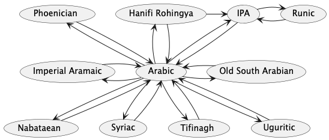

# Abjad-convert Contributing

## Adding new script
Pull requests are welcome. For adding new script. let's say that we want to add a new script "Foo"
- Step #1: create a feature branch from `main` named `abjad-convert/version/0.[x].0` where `x` is the next minor of current version number.
- Step #2: create a new branch that will the previous feature branch when creating the PR.
- Step #3: create a new folder named `foo` in `src`.
- Step #4: add pdf documentation for the script we want to add from www.unicode.org. for example for Ugaritic the file is `U10380.pdf`. this file will be used as a reference
- Step #5: add a new file named `letters.ts` in `foo` folder this file will export
- - `letters` an array of letters written using unicode values with jsdoc each line will contain
    the value of the letter using UTF-16 BE using escape \u followed by 4 hex digits.
    notice that UTF16BE value is not always the same as the unicode value.
    for example for letter Alpa in Ugaritic the unicode value is `0x10380` but the UTF16BE encode value is `0xD800DF80`
    follow the value with jsdoc that contain array index, letter itself, unicode value, and the name of the letter.
    for example for ugaritic looks like this:

```ts
const letters = [
	'\uD800\uDF80', /** #0  𐎀 U+10380 UGARITIC LETTER ALPA */
	'\uD800\uDF81', /** #1  𐎁 U+10381 UGARITIC LETTER BETA */
	//...
];
```

- - 'Fo' an alias object called `Fo` short of Foo. this will give an alias for all letters mentioned in the letters array.

for example for ugaritic looks like this:
```ts
export const Ug = {
	Alpa: letters[0], // 𐎀
	Beta: letters[1], // 𐎁
	//...
};
```

- - `foo` an instance of `Script` class, which will be exported

for example for ugaritic looks like this:
```ts
export const ugaritic = new Script(
	Abjad.Ugaritic, // enum value of the script
	false,          // true if the script is right to left
	letters,        // array of letters
)
```

- Step #6: Add the script to the enum `Abjad` in `src/types.ts` file.
  at this point we have finished adding the script, but it is an island script. Meaning that it can't be converted to or from any other script.

- Step #7: To make it convertable, we need at least to have one "from" and one "to" converter to another script.
  the preferred way is to add a converter to and from Arabic script, as it is currently act as a de facto hub script for all abjad scripts.
  Since version 0.6.0 IPA (International Phonetic Alphabet) is added, it is intended to be as a canonical hub script since IPA can cover all sounds.
  however, the converter can be added to and from any script.
  The algorithm for converting will look first for 1-step converter (direct converter) the one that converts from the source to the target, 
  in case there isn't any it will look for 2-steps approach where it can find a middle script,
  after that it will try 3-steps approach, after that it won't look for 4 or more steps, it will basically throw an error.
  As of version 0.6.0 scripts are connected as follows:
  
- - Adding to Arabic: Add file to `foo` folder with name `toArabic.ts` that include a class called FooToArabicConverter that implements `IConverter` interface.
    it should look like this:
```ts
import { IConverter } from '../../types';
import { Fo } from './letters'
import { Ar } from '../arabic/letters'
import { IConverter } from '../../IConverter'
import { Abjad } from '../../types'

export class FooToArabicConverter implements IConverter {
	public readonly from = Abjad.Foo
	public readonly to = Abjad.Arabic
	public convert(fooText: string): string {
		// convert logic here
		// return (araic text)
	}
}
```
- - Add toArabic converter to `converterFactory.ts`
- - - import the new converter in alphabetical order
```ts
//...
import { FooToArabicConverter } from './foo/toArabic'
//...
```
- - - add the converter to converters array in alphabetical order
```ts
const converters: IConverter[] = [
	//...
	new FooToArabicConverter(),
	//...
];
```
- - Add toFoo converter to `arabic` folder with name `toFoo.ts` that include a class called ArabicToFooConverter that implements `IConverter` interface.
    it should look like this:
```ts
import { Ar } from './letters'
import { Fo } from '../foo/letters'
import { IConverter } from '../../IConverter'
import { Abjad } from '../../types'

export class ArabicToFooConverter implements IConverter {
	public readonly from = Abjad.Arabic
	public readonly to = Abjad.Foo

	public convert(arabicText: string): string {
		// convert logic here
		// return (foo text)
	}
}
```
- - Add toFoo converter to `converterFactory.ts` same like above.

- Step #8 add unit test to`test/index.test.ts`.

- Step #9: update for new version
- - update `CHANGELOG.md` with the new version number and the changes.
- Step #10 update 
- - `README.md` links and badges.
- - version in `package.json` file.
- - run yarn to update `yarn.lock` files
- - run test to update coverage badges
